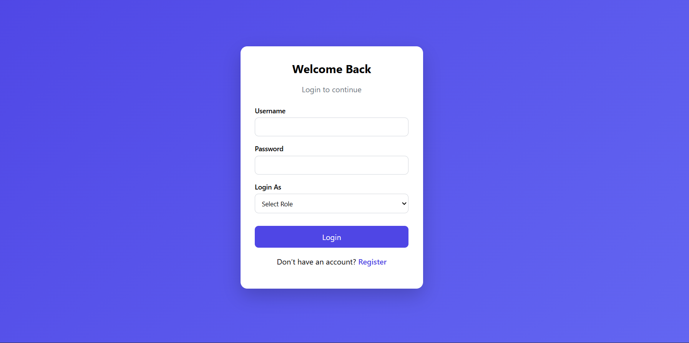
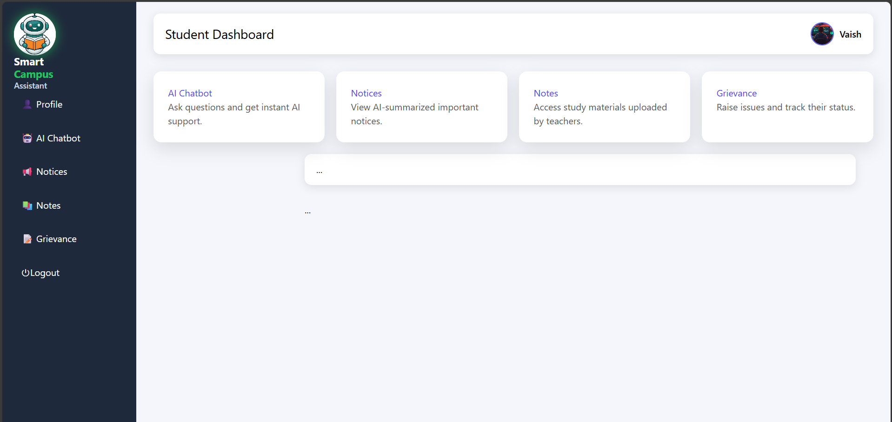
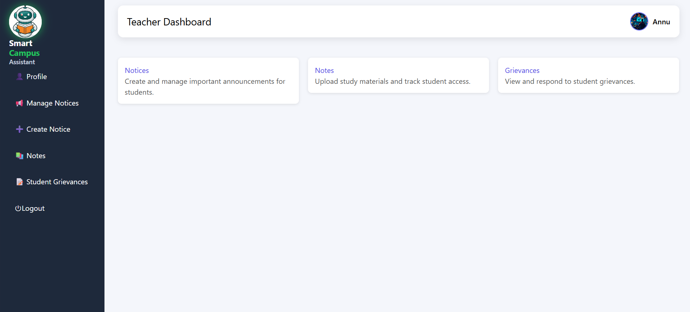

# College Portal – Django Web Application

A role-based college portal built using Django.

## Features
- Student & Teacher Login
- Notes Upload & Access
- AI-based Notice Summarization
- Grievance Management System
- Chatbot using Gemini AI

## Tech Stack
- Django
- SQLite
- HTML, CSS
- Gemini API

## Roles
- Student
- Teacher

## How to Run Locally
```bash
git clone https://github.com/your-username/college-portal.git
cd college-portal
python -m venv venv
venv\Scripts\activate
pip install -r requirements.txt
python manage.py migrate
python manage.py runserver

## 📸 Screenshots

### Login Page


### Student Dashboard


### Teacher Dashboard


### Notices


### Grievance System

